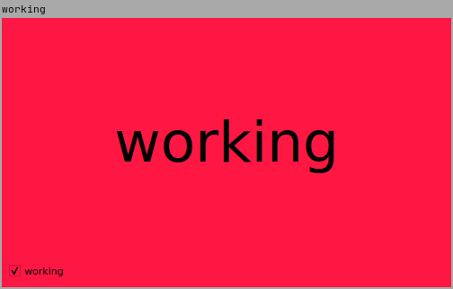
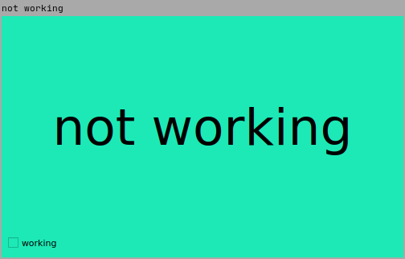

# no-im-working

Let everyone know you're doing very important work and can't talk to them.

 

## Installation

```sh
pip install git+git://github.com/vinhowe/no-im-working.git
```

## Usage

```sh
niw
```
